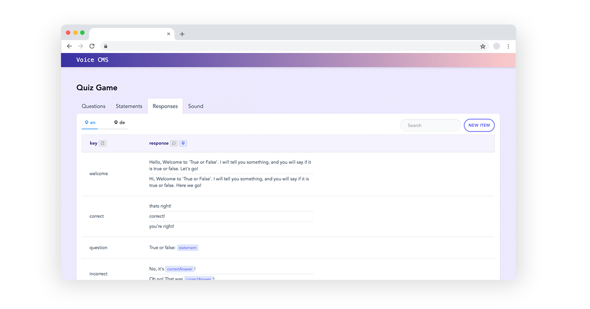

# Voice CMS 

A content management system for voice apps like Alexa Skills and Google Actions.

  

* [Introduction](#introduction)
* [Setup](#setup)
* [Features](#features)

## Introduction

The goal of this open source project is to make it easier to manage content for voice platforms like Alexa and Google Assistant. The CMS can be hosted on your own servers so that you have full control of the data.

Features include:
* **Collections**: Create various collections with different schemas, e.g. responses, business data
* **Content Types**: Supports different types of content, e.g. text, images, audio, and checkboxes
* **Localization**: Select which content types should be localized, e.g. en, de
* **Randomization**: Add content variations that are randomly picked by the voice app
* **Jovo Plugin**: Integrate CMS content with apps built with the Jovo Framework

This repository consists of the following elements:
* `api`: API that handles database calls and structures data. Built with Express.js.
* `client`: The CMS frontend. Built with Vue.js and Element UI.

The plugin for the Jovo Framework can be found here: [pialuna/jovo-plugin-voicecms](https://github.com/pialuna/jovo-plugin-voicecms).

A sample Jovo app, that uses the VoiceCMS Plugin can be found here: [/pialuna/jovo-sample-app-voicecms](https://github.com/pialuna/jovo-sample-app-voicecms).


## Setup 

In the root directory of the project, run:

```bash
npm install
```

This will install all dependencies for the `api` and `client`.

### Database

Voice CMS needs to be connected to a MongoDB database. You can either run your own or create a free database at [MongoDB Atlas](https://www.mongodb.com/cloud/atlas).


### API

First, create a `.env` file based on the `.env.example` file inside `/api`:

```
cd api
cp .env.example .env
```

Add your MongoDB Atlas Database URI to the `.env`:

```
MONGO_URI=<your-mongodb-uri>
```

You can then start the server:

```bash
npm start
```
### Client

To start the Vue.js frontend application, do the following:

```bash
cd client
npm run dev
```

Then go to `localhost:8080` to view the app.

### Integration

Install the Jovo Framework plugin in your Jovo Project like this:

```bash
npm install --save jovo-plugin-voicecms
```

You can find the full documentation for the plugin here: [pialuna/jovo-plugin-voicecms](https://github.com/pialuna/jovo-plugin-voicecms)
    
## Features

### Collections

A Voice CMS project contains one or more collections. A collection represents a specific content schema that is used by the voice app. 
It can be seen as a table that has at least two properties that are represented as columns.

For example, a `Responses` collection may be used to manage the voice app's responses. It includes two columns:
* A `key` used as identifier (a basic textfield)
* A `response` text array field that contains the app output

  

Each row can be edited. More elements can be added to the `responses` array as well:

  

### Content Types

Each collection consists of at least two properties (columns) that can have different types.

The following property types are supported:
* **Text Array**: Typically used for responses, if more than one value is available, the voice app selects a random item. Can contain `{{variables}}`
* **Textfield**: A regular one line short text, e.g. `key`
* **Audio URL**: A URL that is displayed as an audio element
* **Image URL**: A URL that is displayed as an image
* **Tags**: One or more tags
* **Checkbox**: A boolean value that is displayed as checkbox
* **Boolean**: A boolean value that is displayed as switch, showing 'true' or 'false' as words  
* **Date**: A date picker
* **URL**: A clickable URL

For example, audio URLs are displayed like this:

  

Booleans and checkboxes look like this:

  


### Internationalization (i18n)

Voice CMS supports internationalization, which means that its content can be translated into multiple languages.

For a voice apps `Responses` collection, you won't need a column for each locale - just tag the `response` column as an i18n property.
Then there will be a toggle to switch conveniently between locales, even while editing an item, like in this example:

  

The columns with internationalization are marked with the locale icon in the table header.

All properties with internationalization are in a nested `i18n`-object:

```javascript
{
        key: "qs0",
        i18n: {
          statement: {
            en: ["Mount Everest is the tallest mountain in the world. "],
            de: ["Mount Everest ist der höchste Berg der Welt."]
          }
        },
        answer: true,
        live: true
}
```  
### API

The API contains the following endpoints:

```
localhost:1234/projects
	      	  /projects/:id
	      	  /collections/
	      	  /collections/:id
	      	  /items/
	      	  /items/:id
```

To get a complete project (with all its collections and with all items of each collection), send `GET` to `/projects/<your-project-id>?complete=true`. The Jovo Plugin gets the data of a project this way.