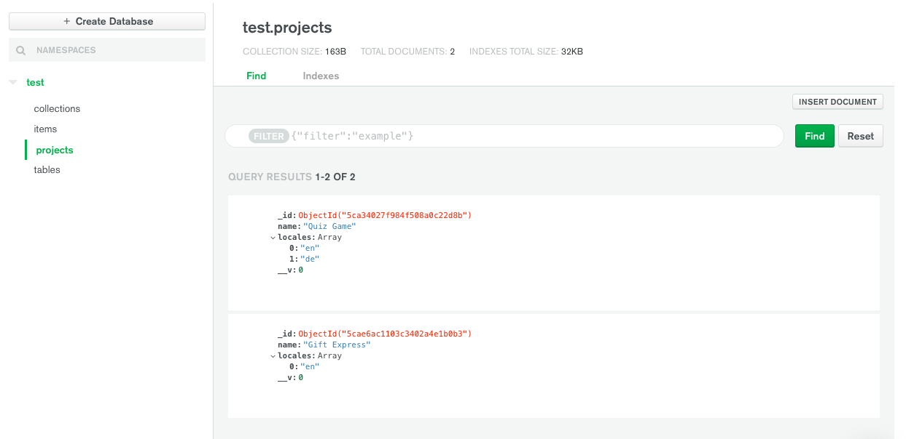
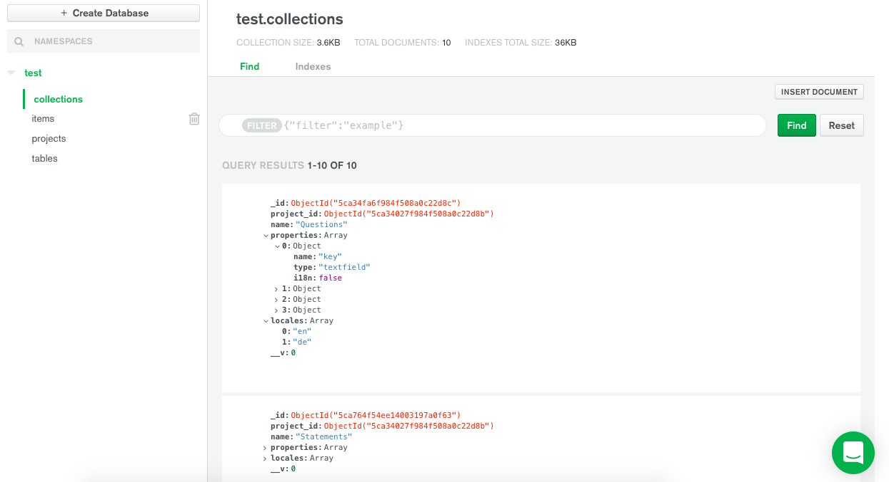
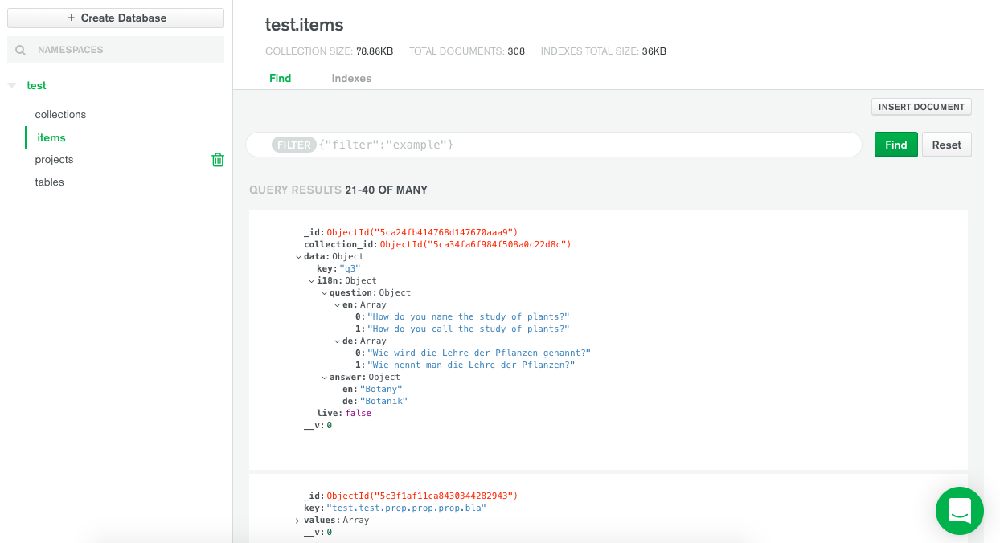

# Voice CMS Server

#### The API for the Voice CMS
using express.js, mongoose.js, MongoDB      
     
       
to run:       
```
npm install    
npm start
```
Server is listening on port 1234

```
localhost:1234/projects
	      /projects/:id
	      /collections/
	      /collections/:id
	      /items/
	      /items/:id
```

____
# Handling Requests
`GET`, `POST`, `PATCH`, `DELETE`

## GET
```
localhost:1234/projects
	      /projects/:id
	      /collections/
	      /collections/:id
	      /items/
	      /items/:id
```

**To get a complete project (with all its collections and with all items of each collection)     
send `GET` to `/projects/:id?complete=true`.**   
example: `http://localhost:1234/projects/5cae6ac1103c3402a4e1b0b3?complete=true`   
The Jovo Plugin gets the data of a project this way.   
     
Normal GET requests to `/project/:id`    
the response contains the    
`_id`,    
`name`,   
(`url`,)   
`locales`-array,    
`collections`-array     
(and each collection there contains an `_id`, `project_id`, `name`, `locales`-array, `properties`-array, (no items) ).   
    
GET Requests to `/collections/:id`     
the response contains the    
`_id`,   
`project_id`,    
`name`,    
(`url`,)    
`locales`-array,   
`properties`-array,   
`items`-array    
(and each item there contains `_id`, `collection_id`, `data`-object.   
      
GET Requests to `/items/:id`    
the response contains the    
`_id`,    
`collection_id`,    
`data`-object.   
    


## POST
**JSON Body examples**

POST to `/projects` to create a project
```javascript
// request body example
{
			"name": "Quiz Game",
			"locales": ["en", "de"]
}
```
POST to `/collections` to create a collection
```javascript
// request body example
{
        "project_id": "5ca34027f984f508a0c22d8b", 
        "name": "Statements",
        "properties": [
	     // this 'properties'-objects must look like this
            {
                "i18n": false,
                "type": "textfield",
                "name": "key"
            },
            {
                "i18n": true,
                "type": "textarray",
                "name": "statement"
            },
            {
                "i18n": false,
                "type": "boolean",
                "name": "answer"
            }
        ],
        "locales": [
            "en",
            "de"
        ]
}
```
POST to `/items` to create an item
```javascript
// request body example
{
		"collection_id": "5ca764f54ee14003197a0f63",
		// 'data' must be an object, but can actually contain anything
		// it should look like this
                "data": {
                    "key": "qs2",
                    "i18n": {
                        "statement": {
                            "en": [
                                "The study of plants is known as botany."
                            ],
                            "de": [
                                "Die Lehre der Pflanzen wird Botanik genannt."
                            ]
                        }
                    },
                    "answer": true
                }
}
```

## PATCH
**JSON Body examples**

PATCH to `/projects/:id` to update a project
```javascript
// request body example
{
			// what ever you want to update
			// example here: only update the "locales" of this project, add "fr"
			// the whole "locales" array needs to be send
			"locales": ["en", "de", "fr"]
}
```
PATCH to `/collections/:id` to update a collection
```javascript
// request body example
{
			// update name
			"name": "Quiz Statements",
			// example here: adding the property named "live"
			// the whole "properties" array needs to be send
			"properties": [
				{
					"i18n": false,
					"type": "textfield",
					"name": "key"
				},
				{
					"i18n": true,
					"type": "textarray",
					"name": "statement"
				},
				{
					"i18n": false,
					"type": "boolean",
					"name": "answer"
				},
				{
					"name": "live",
					"type": "checkbox",
					"i18n": false
				}
			],
}
```
PATCH to `/items/:id` to update an item
```javascript
// request body example
{
		// if you want to update something in "data", the whole data object needs to be send
		// not only the properties in the data object that have changed
		// example here: only 'answer' was changed
                "data": {
                    "key": "qs2",
                    "i18n": {
                        "statement": {
                            "en": [
                                "The study of plants is known as botany."
                            ],
                            "de": [
                                "Die Lehre der Pflanzen wird Botanik genannt."
                            ]
                        }
                    },
                    "answer": false
                }
}
```

## DELETE
to delete a project, a collection, an item
(no body needed)
```
	/projects/:id
	/collections/:id
	/items/:id
```

____
# How do these "projects", "collections", "items" look like in the MongoDB? 

The database is named 'test' and has these four collections, you see in the nav on the left (tables in MongoDB are called 'collections'). (Confusing with our naming! :D ) .   
(the collection 'tables' is from an old project version and can be ignored)

###### "Projects" 


###### "Collections" 


###### "Items" 


That field '__v' is something, Mongoose adds to every document (a document is an object in MongoDB).     
"The versionKey is a property set on each document when first created by Mongoose. This keys value contains the internal revision of the document. The name of this document property is configurable. The default is __v."

______


