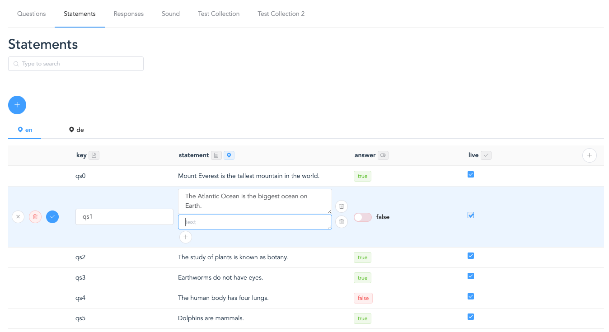

# Voice CMS (Client Application)

> A Vue.js project

## Build Setup

``` bash
# install dependencies
npm install

# serve with hot reload at localhost:8080
npm run dev

```
``` bash
# build for production with minification
npm run build

# build for production and view the bundle analyzer report
npm run build --report

# run unit tests
npm run unit

# run all tests
npm test
```

For a detailed explanation on how things work, check out the [guide](http://vuejs-templates.github.io/webpack/) and [docs for vue-loader](http://vuejs.github.io/vue-loader).       
        
_____    
# Jovo Voice CMS

You can create collections, that are represented as tables.   
These collections can have different properties (columns), like you need it for your project.  

### There are different PropertyTypes:  
**Text Array** (an array of long texts, that can contain {{variables}} for voice response texts)      
**Textfield** (a regular one line short text)   
**URL**   
**Audio URL** (an url that is displayed as an audio element)    
**Image URL** (an url that is displayed as an image)    
**Tags**  
**Checkbox**    
**Boolean** (a switch, that displays 'true' or 'false' as a word)  
**Date**    
   
____
If there are `{{variables}}` in the texts in the `TextArray` vue component, they are displayed as little tags.   
   
While in the `Collection` vue component, all variables are pulled out of all texts of this Collection 
and are displayed on the top. There you can enter example values. These variables are passed down as objects (with name and value) to the TextArray component, where they are displayed. (Currently this solution is not reactive, you have to click edit and cancel on the certain item (to rerender it), where the variable value should be displayed.)

### Responses Collection
with 'key' as a textfield, and 'response' as a textarray
 
____
The properties, that have i18n, are marked with the locale icon next to the property name in the table header.   
   
### Quiz Statements Collection
with 'key' as a textfield, 'statement' as a textarray, 'answer' as boolean, 'live' as a checkbox
  
____
    

**An item of the 'Statements' collection in the `Item`-component looks like this:**   
Only the needed `data`.   
All properties, that have internationalization, are in the nested `i18n`-object.   
The `Item`-component has the `item`(-data) as an object, and a copy, that is named `tempItem`. This `tempItem` is the object that is being edited. When it is saved, it overwrites the `item` in the Vuex Store and everything gets updated.   
```javascript
{
        key: "qs0",
        i18n: {
          statement: {
            en: ["Mount Everest is the tallest mountain in the world. "],
            de: ["Mount Everest ist der höchste Berg der Welt."]
          }
        },
        answer: true,
        live: true
}
```    
**But in the `Vuex Store`, it looks like this:**   
`_id`, `collection_id`, and the `data`-object (like you get it from the API)   
The Vuex Store is the "source of truth".
```javascript
{
            _id: "5ca765274ee14003197a0f64",
            collection_id: "5ca764f54ee14003197a0f63",
            data: {
              key: "qs0",
              i18n: {
                statement: {
                  en: ["Mount Everest is the tallest mountain in the world. "],
                  de: ["Mount Everest ist der höchste Berg der Welt."]
                }
              },
              answer: true,
              live: true
            }
}
```


**The 'Statements' collection in the `Vuex Store` looks like this:**
```javascript
{
        _id: "5ca764f54ee14003197a0f63",
        project_id: "5ca34027f984f508a0c22d8b",
        name: "Statements",
        properties: [
          { name: "key", type: "textfield", i18n: false },
          { name: "statement", type: "textarray", i18n: true },
          { name: "answer", type: "boolean", i18n: false },
          { name: "live", type: "checkbox", i18n: false,}
        ],
        locales: ["en", "de"],
        items: [
		// ... all the items
        ],
}
```

**The 'Quiz Game' Project in the `Vuex Store` looks like this:**
```javascript
{
        _id: "5ca34027f984f508a0c22d8b",
        name: "Quiz Game",
        locales: ["en", "de"],
        collections: [
        // ... all the collections (with all the items)
        ]
 }
```

